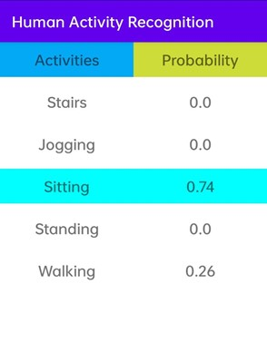
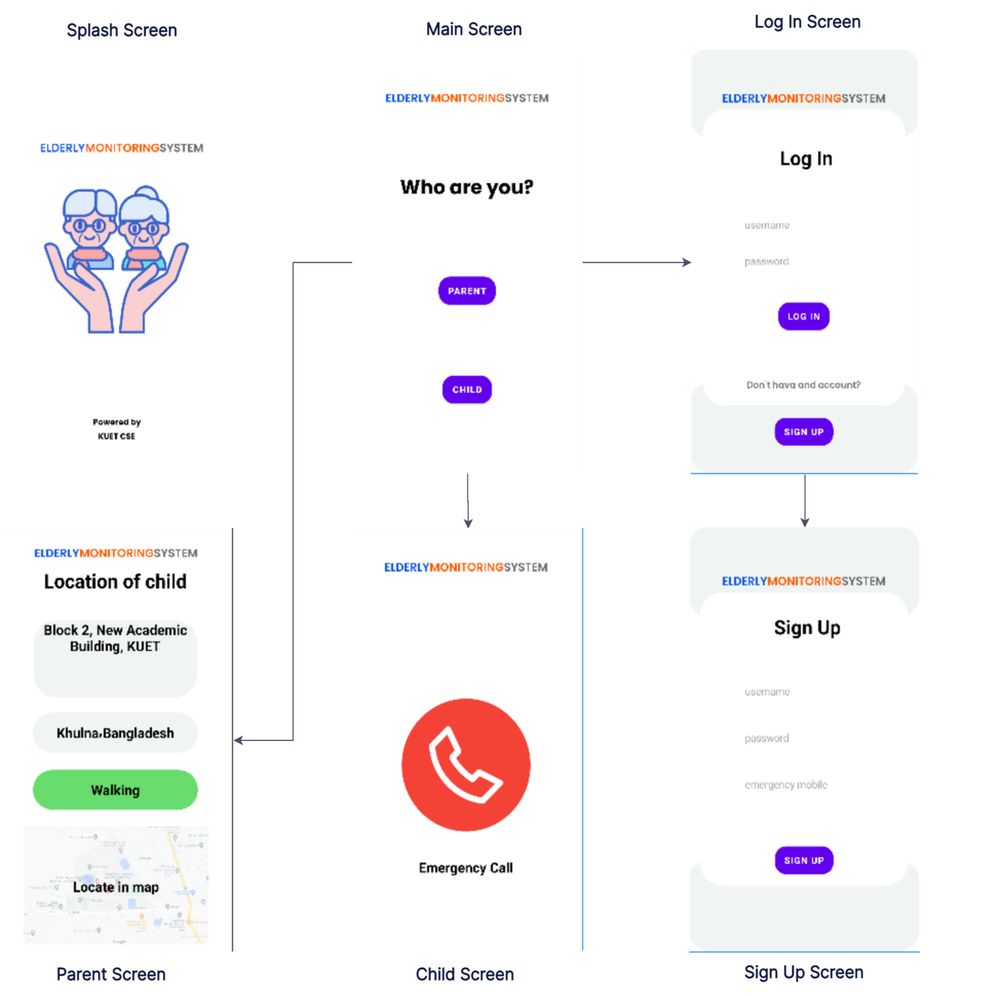

# Elderly-Monitoring-System
Android application for monitoring elder with location and activity recognition

Activity is recognized using smartphone sensors data and the location is tracked by using GPS tracker embedded on smartphone. Machine learning is developed by keras and 
tensorflow in backend. Two mode of this application is parent mode and child mode. Child location and activity will be located by parent. Python flask is used as backend
server and SQL-Alchemy is used for database service. 

## Model application

## Storyboard

